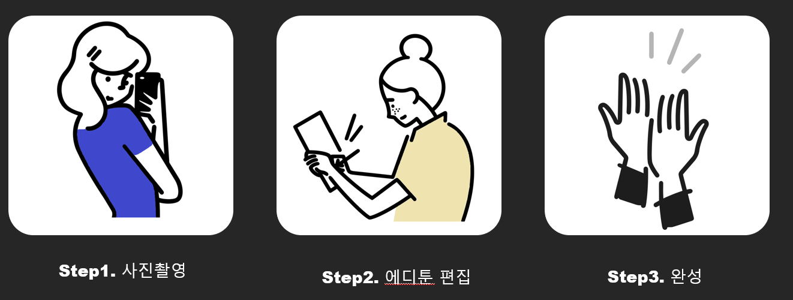

# :rocket: Editoon

그림을 잘 못그리거나 그릴 시간은 없거나, 웹툰을 어떻게 시작해야할지 모르겠는 사람들을 위해

### **편하게 웹툰을 만들 수 있는 사이트**

edit + webtoon 이미지 

##  :sparkles: 프로젝트 구조

### Front 시작하기

```
yarn install
yarn serve

```



## Usage

Django 이미지 변환(UGATIT)

python 3.8 이상에서는 tensorflow 1.14버전이 안깔리는듯 합니다.
python 3.7 이하 버전에서 진행해주세요.


https://drive.google.com/file/d/19xQK2onIy-3S5W5K-XIh85pAg_RNvBVf/view?usp=sharing
-이 링크로 학습된 모델을 다운받으세요.
-압축을 풀고 checkpoint폴더가 생기면, django_for_ai폴더안에 집어넣으세요.
-참고로, manage.py와 같은위치에 checkpoint를 집어넣으면됨.


visual code로 django 서버를 실행한다.
python manage.py runserver

이미지변환을 위한 요청URL: (POST방식) http://127.0.0.1:8000/ai/ImgtoAnime/
필요한 데이터 JSON 타입 {"img": 값}
ex) {"img": "0002.jpg"}


변환할 이미지 파일은 미리 저장되어있어야한다.
\django_for_ai\dataset\selfie2anime 경로 안에 저장해야함.


변환된 결과는 \django_for_ai\output 폴더에 저장된다.


## AI([UGATIT](https://github.com/taki0112/UGATIT))

UGATIT 모델을 사용하여 학습을 했는데, 오른쪽으로 갈수록 학습을 많이 진행한 것인데, 과적합되는 모습을 보임


## 기술스택


