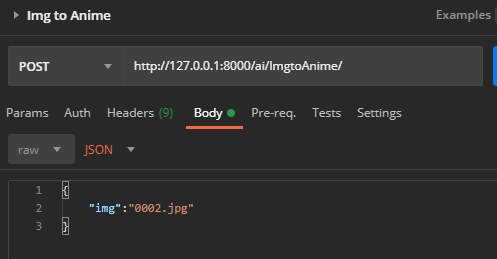
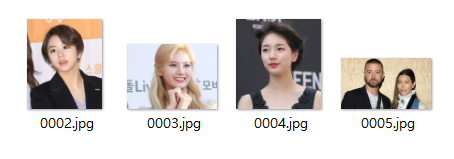

# Editoon Project

## 프로젝트 구조

### Front 시작하기

```
yarn install
yarn serve

```


### Back 시작하기


### Django 이미지 변환(UGATIT)

python 3.8 이상에서는 tensorflow 1.14버전이 안깔리는듯 합니다.

python 3.7 이하 버전에서 진행해주세요.

1. https://drive.google.com/file/d/19xQK2onIy-3S5W5K-XIh85pAg_RNvBVf/view?usp=sharing

   -이 링크로 학습된 모델을 다운받으세요.

   -압축을 풀고 checkpoint폴더가 생기면, django_for_ai폴더안에 집어넣으세요.

   -참고로, manage.py와 같은위치에 checkpoint를 집어넣으면됨.

2. visual code로 django 서버를 실행한다.

   `python manage.py runserver`

3. 이미지변환을 위한 요청URL: (POST방식) `http://127.0.0.1:8000/ai/ImgtoAnime/`

   필요한 데이터 JSON 타입 {"img": 값} 

   ex) {"img": "0002.jpg"}

   

4. 변환할 이미지 파일은 미리 저장되어있어야한다.

   \django_for_ai\dataset\selfie2anime 경로 안에 저장해야함.

   

   - 현재는 002.jpg~0005.jpg에 대해서 테스트가능하다.

5. 변환된 결과는 \django_for_ai\output 폴더에 저장된다.