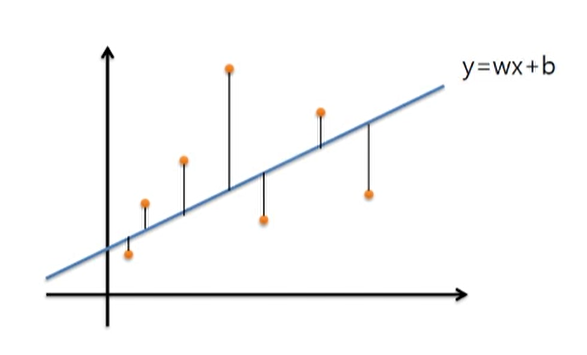
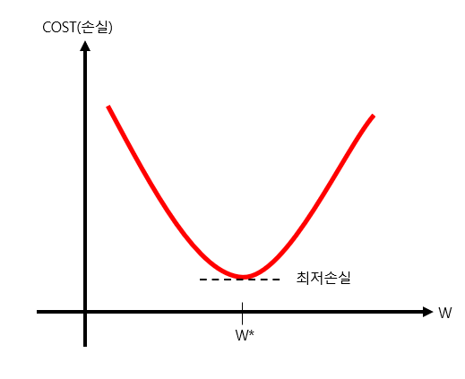
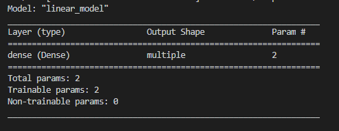

# 인공지능

인간의 지능에 가까운 기능을 갖춘 컴퓨터 시스템

인공지능 시스템을 구현하는 접근 방식이 하나로 **머신러닝**이 있다.


# 머신러닝

컴퓨터가 데이터를 학습하여 처음 보는 데이터를 자동으로 해석할 수 있게 하는 기법

자동으로 해석하기 위해서는 틀 디자인이 필요하다.

그 관계가 선형관계(y=ax+b)일수도있고, 2차 함수형태(y=ax^2+bx+c)일수도있고, 그 이상일 수도 있다.

어떤 틀을 고르느냐에 따라 최적화시킬 변수 갯수가 달라질것이다.

틀을 고른뒤 **손실함수**가 필요하다.


머신러닝 방법중 인공 신경망모델이 있고, 2개 이상의 신경망층을 쌓은 모델을 심층 신경망이라 하며 **딥 러닝**으로 구분한다.


## 머신러닝 분야

* **지도학습**

  :라벨링된 데이터로 학습을 시킨다.

  * **Classification**

    주어진 데이터를 카테고리에 따라 분류함.

    대표적으로 이미지분류를 할수있음.

    예측결과가 YES/NO로 구분되는 것을 **Binary Classification**

    예측결과가 다양할 경우 **Multi-label Classification**

  * **Regression**

    연속된 값을 예측하는 문제.

    패턴이나 트렌드같은 경향을 예측할때 사용.

    EX)

    집크기에 따른 매매가격예측.

    공부시간에 따른 전공시험 점수예측.

* **비지도학습**

  :라벨링되지 않은 데이터로 학습을 시킨다.

  이 경우에도 카테고리가 있는 데이터인지 연속적인 데이터인지로 구분된다.

  대표적으로 **클러스터링**,**차원축소** 같은 것이 있다.

* **강화학습**

  데이터에 정답이 없을 수 도있고, 데이터 자체가 없을 수 도있다. 이때 자신이 한 행동에 대한 **보상**으로 학습하는것을 말한다.

  학습대상(agent)가 스스로 움직이면서 보상을 얻고, 이 과정을 반복학습하면서 보상점수를 최대화하는 방식이다.


# 선형회귀(Linear Regression)

머신러닝에서 선형관계를 틀로 잡았을때, 주어진 데이터를 가장 잘 설명하는 직선을 찾기위해 선형회귀를 사용한다.



주황색 점들이 정답데이터이고, 이에 가장 최적화된 직선 y = wx+b이다.

최적의 기울기w와 편차b를 구하면된다.

대표적인 손실함수로 **평균제곱편차**가 있다. 주어진 정답 데이터쌍들과 예측값 y*의 차이를 제곱한 값을 모든 데이터에 대해 합하고 전체 데이터갯수로 나눈값이다.

손실을 최소로 만드는 것을 **최적화 함수**가 한다.

대표적인 최적화 방법으로 **경사 하강법**이 있다.



평균제곱편차가 최소가되는 것을 구하는 것이 목표이다.

평균제곱편차를 Cost라는 함수로 생각하고, 일차함수 틀 y = wx+b에서 b는 변화하지않는 고정값으로 생각하고, 기울기 w에 대한 Cost의 변화를 그래프로 그려본다.

만약 W값을 최저손실을 내는 W*보다 작게 설정했다면 손실이 크고, W를 증가시키는 방향으로 변화시켜야한다.

반대로 W값을 최저손실을 내는 W*보다 크게 설정했을때도 손실이 크고, W를 감소시키는 방향으로 변화시켜야한다.

다시 정리하면, 

해당 지점의 순간 기울기<0 일때는 W +방향으로 증가.

해당 지점의 순간 기울기>0 일때는 W -방향으로 증가.

이렇게 반복하다보면 순간 기울기가 0이거나 0에 가까워지는 최저손실점을 찾을수있다.

**경사하강법**: Cost를 줄이기 위해 반복적으로 기울기를 계산하여 변수의 값을 변경해나가는 과정.

반복시키는 횟수를 **epoch**라 하고 보통 1000회 이상 시킨다.


# 신경망 네트워크(Neural Network)

단순한 선형 관계인 데이터도 있지만, 현실에 존재하는 복잡한 문제를 선형 모델로 해결하는데 한계가 있다. 그래서 인공신경망 개념이 나왔고, 그중에서도 컨볼루션 인공신경망 **CNN**이 사용된다.


Sub PJT1에서는 CNN 또는 RNN을 학습하기에 앞서 기본적인 선형회귀 모델구조와 학습원리를 이해하는데 초점을 맞춘다.


#### 들어가기전에 파이썬에 참고할것.

파이썬에 argparse라는 라이브러리가 있다.

커맨드라인에 들어오는 추가 입력을 받아 해당 인ㄴ자를 전달하여 실행할 수 있게 도와주는 라이브러리이다. 인공지능 프로젝트에서 매실험마다 파라미터를 변경하는 경우가 많으니 이것을 활용해야한다.

아래 블로그를 참고하면 도움이 될것임.

https://brownbears.tistory.com/413


#### 주요 라이브러리 및 프레임워크

**Numpy**: n차원 array계산을 쉽고 빠르게 해주는 파이썬 패키지.

**Matplotlib**: 데이터 시각화를 위해 사용되는 파이썬라이브러리.

**Tensorflow**: 구글에서 제공하는 머신러닝 오픈소스 플랫폼.

**Keras**: 딥러닝 라이브러리 위에서 실행할 수 있는 high-level neural network API


# 기능 명세

### 1. 단순 선형 회귀 모델

```
# 데이터 불러오기
train_data = np.load(".\\datasets\\linear_train.npy")
text_x = np.load(".\\datasets\\linear_test_x.npy")

# tf 형식에 맞게 변환
x_data = np.expand_dims(train_data[:,0], axis=1)
y_data = train_data[:,1]
```


* .npy확장자는 넘파이 파일을 말한다.

* expand_dims: 차원을 추가하는 것이다.
  * axis=0: x축, axis=1:y축, axis=2:z축으로 생각하면 좋다.

* 보통 2차원 리스트에서 2행3열을 부를때 `arr[2][3]` 으로 부르지만,
  * numpy에서는 arr[2,3]으로 부른다.
  * 따라서 arr[:,1]이라는 모양은 행부분은 처음부터 끝까지 0~r까지이고 열은 1인 리스트를말한다.
  * 예를들어, arr=[[1,2,3],[4,5,6]] 모양의 2*3 2차원배열이 있다 가정하자.
  * arr[:,2] 라고 하면 arr[0,2] arr[1,2]  모두 해당됨.
  * 따라서 2, 5 가 담긴 리스트를 가져올것이다.

expand_dims를 이해하기위해 아래 링크를 참고해보면 도움될수도..

https://www.tutorialspoint.com/numpy/numpy_expand_dims.htm


```
# 최적화 함수, 손실함수와 모델 바인딩
model.compile(optimizer=tf.keras.optimizers.SGD(learning_rate=0.001),
			  loss=tf.keras.losses.MSE,
			  metrics=[tf.keras.metrics.MeanSquaredError()])

# 모델 학습
model.fit(x=x_data, 
		  y=y_data, 
		  epochs=1, 
		  batch_size=10)


# 모델 테스트
prediction = model.predict(x=test_x,
    					   batch_size=None)


# 결과 시각화
plt.scatter(x_data,y_data,s=5,label="train data")
plt.scatter(test_x,prediction,s=5,label="prediction data")
plt.legend() #범례
plt.show()


# 모델 정리
model.summary()
```

keras에서는 모델을 학습시킬때 fit함수를 사용함.

model.fit(x, y, batch_size,epochs=10)

x: 입력데이터

y:라벨값=정답지

batch_size: 몇개의 데이터를 학습하고 라벨값(정답지)와 비교할것인지. 가중치갱신횟수

epochs:학습반복횟수(batch_size규모를 몇번이나 학습할것인지)

https://tykimos.github.io/2017/03/25/Fit_Talk/

https://tykimos.github.io/2017/01/27/Keras_Talk/


plt: 그래프를 그려준다. 결과를 시각화해줌.

plt.scatter는 데이터를 점으로 표시해준다.

http://blog.naver.com/PostView.nhn?blogId=jhnyang&logNo=221401721741&parentCategoryNo=&categoryNo=33&viewDate=&isShowPopularPosts=true&from=search


model.summary(): 모델에 대해 요약해준다.





### 2. 이미지 캡셔닝 Configuration

2-1. 이미지 캡셔닝 모델 구현시 필요한 세팅값을 저장하는  config.py파일 생성

argparse 라이브러리 이용하기!

예를들자면, train.py라는 파일을 커맨드라인에서 run할때 인자를 같이 줄수있는 옵션을 만들라는 의미이다.

commandline>> python train.py --age 25

이런식으로 --age라는 옵션과 그에 해당하는 인자값 25를 입력받는것.


```python
#config.py
import argparse

parser = argparse.ArgumentParser()
# 캡션 데이터가 있는 파일 경로를 옵션으로 받아보자. (예시)
parser.add_argument('--csv_file_path', type=str, default='.\\datasets\\captions.csv')
# age라는 옵션을 만들고 나이를 인자로 받아보자.
parser.add_argument('--age', type=int, default=5)

args = parser.parse_args()
#args.csv_file_path : csv_file_path라는 옵션에 저장된값
#args.age : age라는 옵션에 저장된값
```

2-2. 셋팅 값 저장

train.py를 실행할 때마다 당시의 셋팅 값들(옵션과 인자)을 저장하는 함수를 utils.py에 구현하자.

```python
#train.py

#옵션설정
parser = argparse.ArgumentParser()
parser.add_argument('--image_file_path', type=str, default='.\\datasets')
parser.add_argument('--age', type=int, default=5)

args = parser.parse_args()
# config 저장
utils.save_config(args)
```


 ```python
#utils.py
import os
import json

def save_config(args):
	path = os.path.join(args.image_file_path, "./settings.json")
	res = image_file_path +' '+str(args.age)
	with open(path, 'w') as fp:
		json.dump(res, fp,  indent=4, sort_keys=True)
 ```

--image_file_path 라는 옵션에 들어온 인자 (이미지파일경로 정보) 와 --age라는 옵션에 들어온 인자를 json형식으로 저장한다.

저장위치는 image_file_path/settings.json

settings.json이라는 파일이 없으면 만들어지고, 이미 있으면 추가 써진다.


### 3. 이미지 캡셔닝 데이터 전처리

train.py

```python
# train.py
# 이미지 경로 및 캡션 불러오기
img_paths, captions = preprocess.get_path_caption()
```


data폴더안에 preprocess.py에서 작업.

3-1. 이미지 경로 및 캡션 불러오기

```python
# preprocess.py
def get_path_caption():
    img_paths=[]
    captions=[]
   
    with open("./datasets/captions.csv", newline='') as csvfile:
        reader = csv.DictReader(csvfile,delimiter='|')
        for row in reader:
            img_paths.append(row['image_name'])
            captions.append(row[' comment'])
    return img_paths, captions
```

csvfile을 열고 구분하고 분리할 delimiter 기호를 적는다. (\t, '','|') 같은것들.

https://m.blog.naver.com/PostView.nhn?blogId=real_77&logNo=221224637207&proxyReferer=https:%2F%2Fwww.google.com%2F

img_paths에는 image_name열 데이터들이 담기고, cations에는 comment열 데이터가 담긴다.

```csv
# captions.csv

image_name| comment_number| comment
1000092795.jpg| 0| Two young guys with shaggy hair look at their hands while hanging out in the yard .
1000092795.jpg| 1| Two young , White males are outside near many bushes .
1000092795.jpg| 2| Two men in green shirts are standing in a yard .
```

csv안에 | 를 기준으로 열이 구분되어있다.


3-2. 전체 데이터셋을 분리해서 저장하기

```python
# train.py

# 전체 데이터셋을 분리해 저장하기
train_dataset_path, val_dataset_path = preprocess.dataset_split_save(20,'.\\datasets')

```

```python
# preprocess.py

def dataset_split_save(ratio,file_path):
    train_dataset_path=[]
    val_dataset_path=[]
    res = []
    with open("./datasets/captions.csv", newline='') as csvfile:
        reader = csv.reader(csvfile,delimiter='|')
        for row in reader:
            val_dataset_path.append(row)        
    x = len(val_dataset_path)
    y = int(x * (100 - ratio) / 100)
    train_dataset_path, val_dataset_path = val_dataset_path[:y], val_dataset_path[y:]

    path = os.path.join(file_path, "./train.json")
    with open(path, 'w') as fp:
        json.dump(train_dataset_path, fp,  indent=4, sort_keys=True)


    path2 = os.path.join(file_path, "./test.json")
    with open(path2, 'w') as fp:
        json.dump(val_dataset_path, fp,  indent=4, sort_keys=True)

    return path,path2
```

train.json과 test.json으로 전체데이터셋중 학습용 데이터셋과 테스트용 데이터셋을 구분해서 저장해둔다.

테스트용으로 쓰고싶은 비율을 dataset_split_save 의 인자로 넣어주면된다.

만약에 20%를 원해서 20을 넣어주면, 전체 데이터가 100개치면, 80개의 학습용데이터와 20개의 테스트용 데이터로 나뉘어서 저장될것이다.


3-3. 저장된 데이터셋 불러오기

```python
# train.py
# 저장된 데이터셋 불러오기
img_paths, caption = preprocess.get_data_file("test.json") #테스트용데이터를 불렀다.
```

학습용데이터를 불러와도되고 테스트용 데이터를 불러와도 된다.

```python
# preprocess.py

def get_data_file(file_name):
    img_paths=[]
    captions=[]
   
    with open("./datasets/"+file_name) as jsonfile:
        reader = json.load(jsonfile)
        for row in reader:
            img_paths.append(row[0])
            captions.append(row[2])
    return img_paths, captions
```


### 4. 데이터 시각화

4-1. 이미지와 캡션 시각화

```python
# train.py

# 이미지와 캡션 시각화 하기
utils.visualize_img_caption(img_paths[0],caption[0])
```

```python
# utils.py

# 이미지와 캡션 시각화
def visualize_img_caption(img_path,caption):
	img = mpimg.imread("./datasets/images/images/"+img_path)
	plt.imshow(img)
	plt.title(caption)
	plt.show()
```

